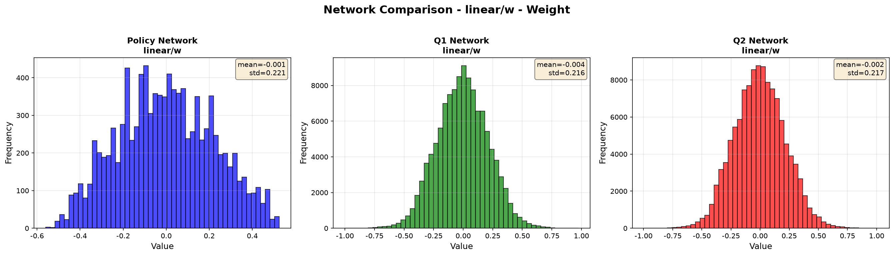
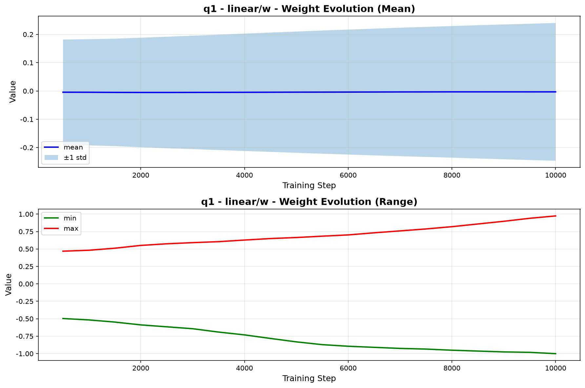

# 训练数据分布统计

## 任务目标

统计训练过程中权重、激活和梯度的数据分布，最终生成对应的数据分布的直方图。便于直观地看出数据分布情况。

## 任务难点

模型结构复杂且庞大，无法完全统计，太费时了。模型中：
1. 网络有三种：policy、q1、q2；
2. 层数很多；
3. 训练的轮数很多。

因此采用抽样统计策略。

## 实现方案

### 采样策略
- **步数采样**：每隔 N 个更新步收集一次数据（`--data_collection_interval` 可配置）
- **层采样**：通过 `--data_collection_layers` 指定收集的层（如 `linear_0,linear_1`）
  - 注意：Haiku 中首个 Linear 层名为 `linear`（不带下标），`linear_0` 会自动匹配首层 `linear`
- **数据类型**：第一版实现权重（weights）收集；梯度/激活收集接口已预留（`collect_gradients`），作为后续扩展

### 工具实现
- `utils/data_collector.py`：训练时数据收集器（`DataCollector`），采样并保存为 `.npz`
- `utils/statistics.py`：统计量计算（均值、标准差、分位数等）、数据加载与分组
- `utils/visualization.py`：可视化（直方图、分布演化、网络对比、多层对比），图表文字使用英文
- `analyze_distribution.py`：主分析脚本，生成统计 JSON、PNG 图表和汇总报告

### 使用方法

训练时启用数据收集：
```bash
python scripts/train_mujoco.py \
    --alg sdac --env HalfCheetah-v4 \
    --total_step 50000 --start_step 5000 \
    --enable_data_collection \
    --data_collection_interval 500 \
    --data_collection_layers "linear_0,linear_1" \
    --disable_evaluator \
    --suffix data_dist_test
```

- 数据保存在 `logs/<env>/<exp_name>/data_distribution/weights_*.npz`
- `--disable_evaluator`：数据分布统计实验建议禁用评估子进程（保持最简训练流程）

分析已收集的数据：
```bash
python zczhou/data_distribution/analyze_distribution.py \
    --data_dir logs/HalfCheetah-v4/<exp_name>/data_distribution \
    --output_dir zczhou/data_distribution
```

## 实验设置

- 环境：HalfCheetah-v4
- 算法：SDAC（简化设置：禁用评估器）
- 总采样步数：50,000（更新步约 10,000）
- 向量环境数：5
- 数据收集间隔：500 更新步（共 20 个采样点：step 500 ~ 10,000）
- 收集层：`linear_0`（首层，对应 Haiku 的 `linear`）、`linear_1`
- 收集网络：policy、q1、q2

## 实验结果

结果文件位于 `zczhou/data_distribution/` 下：

- `weight/<network>/<layer>_stats.json`：各层权重统计量（均值、标准差、最值、中位数、分位数）
- `weight/<network>/<layer>_hist.png`：各层权重直方图
- `weight/<network>/<layer>_evolution.png`：各层权重分布随训练步的演化（均值±标准差、最值范围）
- `weight/<network>/<network>_layers_comparison.png`：同一网络多层分布对比
- `weight/network_comparison_*.png`：三网络同层分布对比
- `summary_report.md`：汇总报告

### 首层权重（linear/w）整体分布（20 个采样点聚合）

| 网络 | 均值 | 标准差 | 最小值 | 最大值 | 样本数 |
|------|------|--------|--------|--------|--------|
| policy | -0.0006 | 0.2212 | -0.5602 | 0.5245 | 10,240 |
| q1 | -0.0041 | 0.2158 | -1.0009 | 0.9737 | 117,760 |
| q2 | -0.0022 | 0.2172 | -0.9960 | 1.0076 | 117,760 |

### 部分结果图

三网络首层权重分布对比：



Q1 网络首层权重分布演化（20 个采样点）：



完整图表见 `weight/` 目录（共 31 张 PNG、12 个统计 JSON）。

## 结论

1. **权重初始化良好**：三个网络的权重分布均接近零均值，无异常偏移
2. **训练稳定**：权重分布随训练步数变化平缓，均值和标准差波动很小，未出现爆炸或崩溃迹象
3. **网络差异**：policy 与 q1/q2 的权重标准差量级相近（约 0.22），Q 网络个别权重幅值略大（|w| 接近 1.0）

## 改进建议

1. 增加梯度统计功能，更全面监控训练过程（接口已预留，需要在 JIT 函数中返回梯度）
2. 增加激活值统计，检查是否存在死神经元
3. 对比不同超参数设置下的分布差异
