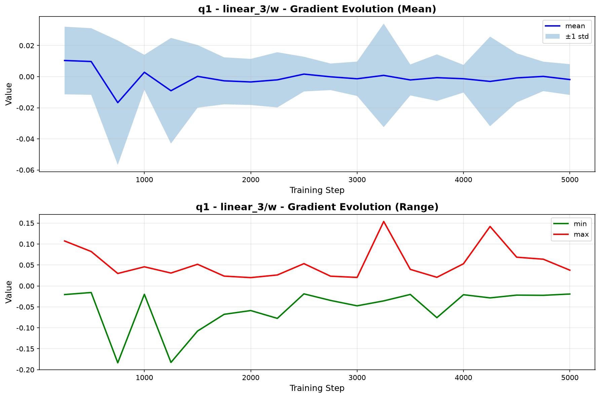

# 训练数据分布统计

## 任务目标

统计训练过程中权重、激活和梯度的数据分布，最终生成对应的数据分布的直方图。便于直观地看出数据分布情况。

## 任务难点

模型结构复杂且庞大，无法完全统计，太费时了。模型中：
1. 网络有三种：policy、q1、q2；
2. 层数很多；
3. 训练的轮数很多。

因此采用抽样统计策略。

## 实现方案

### 采样策略
- **步数采样**：每隔 N 个更新步收集一次数据（`--data_collection_interval` 可配置）
- **层采样**：通过 `--data_collection_layers` 指定收集的层，默认 `linear_0~linear_5` 覆盖全部层
  - policy（DACERPolicyNet）共 6 个 Linear 层：`linear`~`linear_5`（前 2 层为时间编码 MLP，后 4 层为策略主干）
  - q1/q2（QNet）共 4 个 Linear 层：`linear`~`linear_3`
  - 注意：Haiku 中首个 Linear 层名为 `linear`（不带下标），`linear_0` 会自动匹配首层
- **数据类型**：权重、梯度、激活值三类（`--data_collection_types` 可配置）
  - **权重**：JIT 外直接读取当前参数
  - **梯度**：`stateless_update`（JIT 内）通过 `jax.value_and_grad` 计算后经 info dict 返回（`grad_q1/grad_q2/grad_policy` 键，JIT 外弹出转存，不污染训练日志）
  - **激活值**：JIT 外用 `hk.intercept_methods` 拦截 `hk.Linear.__call__` 输出，对当前 batch 单独跑一次前向（Q 网络：`q(obs, action)`；Policy：`policy(obs, action, t=0)`），零 JIT 侵入
  - 激活值为 batch 数据，每层展平后截断至 2048 个元素控制体积

### 工具实现
- `utils/data_collector.py`：训练时数据收集器（`DataCollector`），三类数据分别缓存、立即落盘为 `weights_*.npz` / `gradients_*.npz` / `activations_*.npz`
- `utils/statistics.py`：统计量计算（均值、标准差、最值、中位数、分位数）、三类数据统一加载与分组
- `utils/visualization.py`：可视化（直方图、分布演化、网络对比、多层对比），图表文字使用英文
- `analyze_distribution.py`：主分析脚本，通用分析三类数据，输出 `weight/`、`gradient/`、`activation/` 三目录及汇总报告

### 使用方法

训练时启用数据收集：
```bash
python scripts/train_mujoco.py \
    --alg sdac --env HalfCheetah-v4 \
    --total_step 25000 --start_step 2500 \
    --enable_data_collection \
    --data_collection_interval 250 \
    --data_collection_layers "linear_0,linear_1,linear_2,linear_3,linear_4,linear_5" \
    --data_collection_types "weight,gradient,activation" \
    --disable_evaluator \
    --suffix data_dist_full_v2 --seed 100 --num_vec_envs 5
```

- 数据保存在 `logs/<env>/<exp_name>/data_distribution/` 下的 `weights_*.npz`、`gradients_*.npz`、`activations_*.npz`
- `--disable_evaluator`：数据分布统计实验建议禁用评估子进程（保持最简训练流程）
- 采样间隔基于**更新步**（`state.step`）；向量环境数 5 时更新步 = 采样步/5

分析已收集的数据：
```bash
python zczhou/data_distribution/analyze_distribution.py \
    --data_dir logs/HalfCheetah-v4/<exp_name>/data_distribution \
    --output_dir zczhou/data_distribution
```

## 实验设置

- 环境：HalfCheetah-v4
- 算法：SDAC（简化设置：禁用评估器）
- 总采样步数：25,000（更新步 5,000）
- 向量环境数：5
- 数据收集间隔：250 更新步（共 20 个采样点：step 250 ~ 5,000）
- 收集层：全部层（policy 6 层、q1/q2 各 4 层）
- 收集类型：权重 + 梯度 + 激活值

## 实验结果

结果文件位于 `zczhou/data_distribution/` 下，三类数据各目录包含：`<network>/<layer>_stats.json`（统计量）、`<layer>_hist.png`（直方图）、`<layer>_evolution.png`（演化）、`<network>_layers_comparison.png`（多层对比）、`network_comparison_*.png`（跨网络对比）：

| 数据类型 | PNG 图表 | 统计 JSON |
|---------|---------|----------|
| 权重 | 67 | 28 |
| 梯度 | 67 | 28 |
| 激活值 | 35 | 14 |
| **合计** | **169** | **70** |

`summary_report.md` 为自动生成的汇总报告。

### 权重分布

首层权重（`linear/w`，20 个采样点聚合）：

| 网络 | 均值 | 标准差 | 最小值 | 最大值 |
|------|------|--------|--------|--------|
| policy | ~0 | 0.16 | -0.38 | 0.38 |
| q1 | ~0 | 0.06 | -0.27 | 0.21 |
| q2 | ~0 | 0.06 | -0.27 | 0.21 |


### 梯度分布

| 网络 | 层 | 梯度 std | 量级 |
|------|-----|---------|------|
| q1 | linear_1/w | 1.5e-3 | 10^-3 |
| policy | linear_1/w | 1.2e-7 | 10^-7 |
| policy | linear_5/w | 8.6e-6 | 10^-6 |

- **Q 网络梯度正常**：std 约 1e-3，分布零均值钟形，无梯度爆炸
- **Policy 梯度极小**：比 Q 网络小 3~4 个数量级（1e-7~1e-5）。这与 SDAC 的设计相关：policy 延迟更新（`delay_update=2`）、扩散损失加权及 log_alpha 调节共同作用。末层（linear_5）梯度大于首层约 2 个数量级，符合"梯度从输出层向输入层回传逐层衰减"的一般规律，但衰减幅度较大，值得在后续工作中关注是否存在梯度消失风险



### 激活值分布

| 网络 | 层 | 均值 | 标准差 | 范围 |
|------|-----|------|--------|------|
| policy | linear_1 | -0.03 | 0.08 | [-0.26, 0.16] |
| policy | linear_5 | ~0 | 0.30 | [-1.6, 1.5] |
| q1 | linear_1 | -0.40 | 1.98 | [-16.8, 7.8] |

- **Policy 激活健康**：时间编码层（linear/linear_1）输出幅度小（std~0.08），策略主干激活适中（std~0.3），无饱和迹象
- **Q1 网络中间层激活范围较大**（linear_1 达 [-16.8, 7.8]），表明 Q 函数中间特征幅度较高，但无死神经元（分布连续、无集中在零的尖峰）


## 结论

1. **权重分布**：三个网络全层权重接近零均值，policy 首层标准差（0.16）大于 Q 网络（0.06），训练中分布平稳
2. **梯度分布**：Q 网络梯度健康（std~1e-3，无爆炸）；policy 梯度量级极小（1e-7~1e-5），末层到首层衰减约 2 个数量级，需关注扩散策略的梯度消失风险
3. **激活值分布**：policy 各层激活无饱和、无死神经元；Q1 网络中间层激活幅度较大（范围达 ±16），建议后续检查是否影响 Q 值估计的数值稳定性
4. **训练稳定性**：三类数据的分布随训练步演化平缓，未出现爆炸/崩溃迹象

## 改进建议

1. policy 梯度过小：可对比不同 `delay_update` / 学习率设置下的梯度分布，评估是否需要梯度缩放
2. 激活值收集目前取 t=0 的前向，可扩展为随机采样多个 t 求平均
3. 对比不同超参数设置下的分布差异
