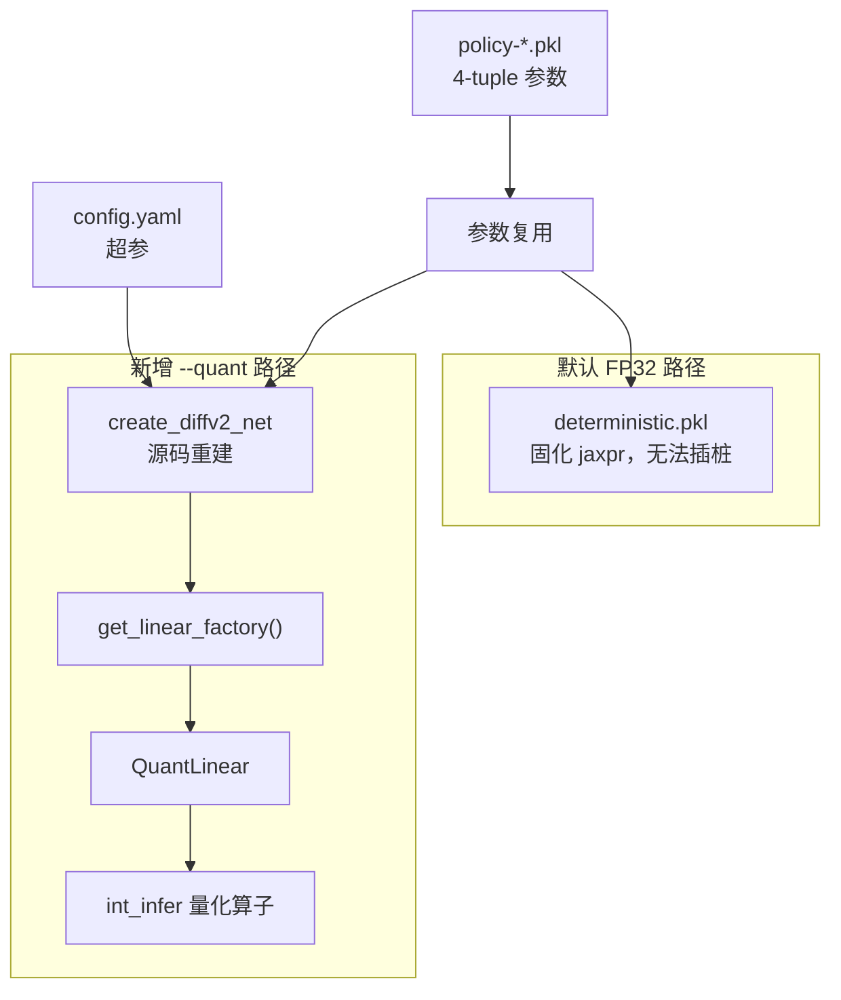

# INT8 量化推理实验报告

对 DACER/SDAC 扩散策略的 MLP 层做 INT8 量化推理（权重与激活都是 INT8），目标是回报不明显下降。

**结论**：3 个 seed、每个完整 1000 步，平均回报 **11480.7 vs FP32 11948.0，掉幅 3.9%**，落在个位数百分比的验收线内。


| 项          | 值                                                  |
| ---------- | -------------------------------------------------- |
| 环境 / 算法    | HalfCheetah-v4 / sdac                              |
| checkpoint | `policy-1000000-200000.pkl`                        |
| 网络规模       | hidden 256 x 3，diffusion_steps 20，num_particles 32 |
| 量化范围       | 所有 `hk.Linear`（策略网 6 个 + Q 网 4 个），两网主干首层各除外（详见 5.1） |
| 权重         | per-output-channel 对称 INT8                         |
| 激活         | 动态非对称 UINT8，分组 scale（group=8）                      |
| 累加         | `int8 x int8 -> int32` 真整数累加，bias 保持 FP32          |
| 未量化        | mish / sin-cos / softplus / tanh、扩散递推系数、argmax 选优  |
| 提交         | `70cdb59`，已合并到 `main`                              |


---


## 一、背景与核心障碍

`single_infer.py` 原本加载的是训练时固化的 `deterministic.pkl`：

```python
policy = PersistFunction.load(log_dir / "deterministic.pkl")
```

这是一张已经展平的 jaxpr 计算图，里面只有 `dot_general` 这类裸算子，**没有任何可插桩的位置**。量化必须换一条路：从源码用 `config.yaml` 的超参重建网络。

换路径就引入了一个前置风险——如果重建出的网络和固化图本身就不等价，那量化前后的差异就无法干净归因。所以第一件事是自证等价：用 `config.yaml` 调 `create_diffv2_net`，对 5 组 obs（含全零与随机）与 `deterministic.pkl` 比对，得到 **MAX DIFF = 0.0**，全零 obs 输出 `[0.9928, -0.6576, 0.8555, 0.2513, -0.9967, -1.0]`，与既有记录一致。这条等价性后来固化成 `--from_source` 开关，作为回归项常驻。




## 二、量化方案与实测依据

方案里的每一项都由实测分布或端到端回报支撑，不是照搬默认配方。

**权重：per-output-channel 对称 INT8**，`scale = absmax(axis=0)/127`。各层权重分布很干净，`absmax/p99.9` 最大仅 2.65，无离群值。张量级相对误差上 per-channel 相比 per-tensor 改善极小（`q_net/linear_2` 0.0730 → 0.0729），但端到端差别明显：per-tensor 掉 4.6%，per-channel 掉 2.1%。

**激活：动态非对称 UINT8**，`scale=(hi-lo)/255` 带 zero-point。两个依据：mish 输出下界恒为 `-0.3088`，分布单侧偏斜，对称量化会浪费一半码字；激活 `absmax/p50` 最大只有 3.22，没有严重离群，直接取 min/max 做动态量化即可，**不需要校准集和校准流程**。

**bias 保持 FP32**，与 int32 累加结果相加。

**真整数累加**而非纯 fake-quant。反量化公式（激活带 zero-point `z`、权重对称）：


```
x @ w  ≈  s_x * s_w * (acc - z * colsum) + b
       其中 acc = xq @ wq (int32), colsum = sum_k wq[k, :]
```


`acc = xq @ wq` 走 `preferred_element_type=jnp.int32`，`colsum` 是 `wq` 的列和，随权重量化一次算好。同时保留 `fake` 模式（量化-反量化后走 FP32 matmul）用于隔离数值问题。

激活范围实测摘要（30 步 rollout）：


| 位置                                                 | absmax             |
| -------------------------------------------------- | ------------------ |
| obs / 各网首层输入                                       | 20.05              |
| 策略主干 `linear_3_in` / `linear_4_in` / `linear_5_in` | 5.48 / 8.97 / 6.49 |
| Q 网 `linear_3_in`                                  | 27.94              |

## 三、验收指标的选择：为什么只看 ep_ret

这一点必须先立起来，否则后面所有数字都会被误读。

仅权重量化的早期实验（150 步）里出现了一个反直觉现象：单步动作最大差异达 **1.99**，而动作域只有 `[-1, 1]`，但回报几乎不掉。

原因在 `get_deterministic_action`：它用 `argmax` 从 32 条候选动作里选 Q 值最高的一条。量化带来的微小扰动足以翻转这个选择，让动作看起来"跳变"，但候选本身都是高分动作，换一条不影响表现。

**所以逐动作比对在这个模型上没有意义，验收只能看 `ep_ret`。** 同理，短程 rollout 的回报也会被 argmax 噪声污染——后面 gs=8 与 gs=16 在 300 步上出现的非单调差异就是这个来源，最终结论一律用完整 1000 步、多 seed 确认。

## 四、调试过程：两个必须解决的问题

按原方案实现完，回报掉 42%，远超验收线。定位出两个问题。

### 4.1 工厂注入时机错误（真 bug）

最初的做法是建网时临时设置 Linear 工厂。但 `relax/network/blocks.py` 的 `mlp()` 是在 haiku 的 **apply 期间**才调用 `get_linear_factory()` 的（每次 apply 都会重新追踪模块）。结果 `QuantLinear` 只在形状初始化时被用到，真正推理时工厂已经恢复成 `hk.Linear`——**量化根本没生效**，回报与 FP32 完全一致。

修正为把工厂设置包在每次 apply 外层：

```python
def _quantized(fn):
    def wrapped(*args, **kwargs):
        prev = blocks.get_linear_factory()
        blocks.set_linear_factory(QuantLinear)
        try:
            return fn(*args, **kwargs)
        finally:
            blocks.set_linear_factory(prev)
    return wrapped
```

顺带的收益是 `q` / `policy` 两支可以各自独立选择是否量化，`--quant_target` 的消融就是靠这个实现的。

这个 bug 有教训意义：量化"没生效"的表现是回报完全正常，与"实现正确"在指标上无法区分。后来的 `--weight_per_tensor` 对照（必须掉精度）就是用来兜住这种静默失效的。

### 4.2 位宽归因：误差全在激活

用 `fake` 模式做位宽扫描，把权重和激活的贡献拆开：

| 配置 | 相对 FP32 |
|---|---|
| W16 A16 | **0.0%** |
| W8 A16 | −3.2% |
| W16 A8 | −50.7% |

结论很干净：W16A16 精确为 0 证明整条量化管线本身没有实现错误；**误差几乎全部来自激活量化，8bit 权重完全够用**。

根因是**单个 scale 覆盖整个 256 维向量太粗**。尤其 Q 网首层输入是 `concat(obs, act)`，obs 的 absmax 约 20 而动作只在 `[-1, 1]`，共享 scale 会把动作分量压到只剩几个码字——而 Q 网的职责恰恰是区分 32 个候选动作的细微差别。

### 4.3 一个中途引入又收回的不安全改动

做位宽扫描时需要 16bit，我把配置校验的位宽上界从 8 放宽到 16，同时让 `int_matmul` 的存储 dtype 跟随位宽。随后 W16A16 在 `int` 模式下返回 **−101.7%**——这不是结果而是溢出：`int16 x int16` 累加 256 项约 2.1e9，越过 int32 上界并静默回绕。

修正为：`int` 模式只允许 ≤8bit（8bit 累加 256 项约 8.5e6，裕度充足），超过 8bit 只能走 `fake`（FP32 matmul）做误差归因。这条约束现在写在 `QuantConfig.__post_init__` 里会直接抛错。

## 五、决定性一招：分组激活量化

针对 4.2 的根因，加入**分组激活量化**：输入维每 `group_size` 个分量共享一个 scale，组内 int8 累加、组间 FP32 求和。权重和激活**仍然都是 INT8**，没有偷偷放宽位宽。

```python
xg = x.reshape(*x.shape[:-1], groups, gs)
wqg = wq.reshape(groups, gs, w.shape[-1])
acc = jnp.einsum("...gk,gko->...go", xq_i, wq_i, preferred_element_type=jnp.int32)
```

G 维是成对匹配而非收缩，所以每组各自累加。输入维用 0 padding 补齐到 `group_size` 整数倍（激活补 0、权重补 0，贡献恒为 0），这样组大小不必整除各层输入维（17 / 23 / 39 / 256 混在一起）。

组大小的选择过程：在 300 步上 gs=8 得 −6.0%、gs=32+skip-first 得 −5.5%，但 gs=8 比 gs=16 好 33 分，非单调——按第三节的判断这是 argmax 噪声，于是改用完整 1000 步、3 个 seed 定标，最终取 **gs=8 + skip-first** 作为默认。

在落地前先对算子做了单元验证：`int` 与 `fake` 两条路径数值吻合到 1e-6，padding 与 batch 形状正确。这里也暴露了方法上的一个坑——合成随机张量上分组几乎不改善误差，与位宽归因的结论矛盾，说明**合成测试没能复现真实失效模式**，最终只能靠端到端回报定论。

### 5.1 配合首层保持 FP32

**两张网各跳一层，跳的是整层**（权重与激活都不量化，退回 FP32 matmul）。判定名单只有两个元素：

```python
_FIRST_LAYER_NAMES = ("q_net/linear", "dacer_policy_net/linear_2")
```

**为什么是整层，而非只跳权重或只跳激活。** 命中名单后 `config` 直接被置成 `None`，这一层就走 `jnp.dot(inputs, w)`，与改动前的 `hk.Linear` 完全一致。这个粒度是 INT8 本身决定的：整数收益来自 `int8 x int8 -> int32` 累加，两个操作数必须同时是整数；只量化权重而激活留 FP32 的话乘法仍是浮点（对应 `quantize_act=False` 分支退回 `x @ wd`），拿不到整数运算的好处。所以"跳过"只有整层这一种粒度。

**为什么策略网跳的是 `linear_2` 而不是 `linear`。** 这是全篇最容易看错的一点。haiku 按实例化顺序自动编号，而策略网的前两个 Linear 属于时间编码支路：

```python
te = Linear(self.time_dim * 2)(te)   # dacer_policy_net/linear
te = self.activation(te)
te = Linear(self.time_dim)(te)       # dacer_policy_net/linear_1
input = jnp.concatenate((obs, act, te), axis=-1)
return mlp(...)(input)               # 主干从 linear_2 开始
```

| 模块名 | 角色 | 输入 | 跳过 |
|---|---|---|---|
| `dacer_policy_net/linear` | 时间编码支路 | 正弦嵌入，范围 `[-1,1]` | 否 |
| `dacer_policy_net/linear_1` | 时间编码支路 | 上一层 mish 输出 | 否 |
| `dacer_policy_net/linear_2` | **主干首层** | `concat(obs, act, te)` | **是** |
| `dacer_policy_net/linear_3` … `linear_5` | 主干 | 隐层激活 | 否 |
| `q_net/linear` | **主干首层** | `concat(obs, act)` | **是** |
| `q_net/linear_1` … `linear_3` | 主干 | 隐层激活 | 否 |

时间编码那两层编号在前，但输入是正弦嵌入、天然落在 `[-1, 1]`，量化无损，不必跳。Q 网没有时间编码支路，所以它的主干首层就叫 `linear`——两张网名字对不上正是这个结构差异导致的。

**判断标准是"输入是否未归一化"，而不是位置靠前。** obs 各维量纲混杂、absmax 约 20，拼在一起的 act 只在 `[-1, 1]`，共享激活 scale 会把动作分量压到只剩几个码字；其余层的输入都是 mish 输出，已被前层规整过，量化友好得多。

代价很小：两张网共 10 个 Linear 里只有 2 个退回 FP32，其余 8 个仍是 INT8。消融支持这个取舍——首层也量化时回报从 −2.1% 掉到 −5.6%。该行为可配：`--no_skip_first_layer` 关掉它，`--fp32_modules q_net/linear_3` 可手动指定别的层保持 FP32。

## 六、最终结果

### 6.1 主结果（3 seed，完整 1000 步）

| seed | FP32 | INT8 | 差异 |
|---|---|---|---|
| 0 | 11842.0 | 11593.6 | −2.1% |
| 1 | 11989.6 | 11336.7 | −5.4% |
| 2 | 12012.4 | 11511.8 | −4.2% |
| **平均** | **11948.0** | **11480.7** | **−3.9%** |

### 6.2 消融（seed 0，1000 步）

| 配置 | ep_ret | vs FP32 |
|---|---|---|
| 默认 both | 11593.6 | −2.1% |
| 只量化 policy | 12033.8 | +1.6% |
| 只量化 q | 11302.8 | −4.6% |
| mode=fake 对照 | 11676.0 | −1.4% |
| 权重 per-tensor | 11301.5 | −4.6% |
| 首层也量化 | 11178.0 | −5.6% |
| 激活不分组 | 10036.4 | **−15.2%** |

两个读点：误差主要来自 **Q 网**（只量化 policy 甚至略微为正，落在 seed 波动范围内），与"输入层 obs/act 尺度失配"的分析一致；分组激活量化是**决定性因素**，去掉它掉幅从 2.1% 恶化到 15.2%。

### 6.3 正确性门槛

| 检查 | 结果 |
|---|---|
| 参数树 key/shape 与 checkpoint 一致 | 通过（policy 12 项、q 8 项） |
| 模块名未退化成 `quant_linear` | 通过（`linear`…`linear_5` / `linear`…`linear_3`） |
| `--from_source` 与固化图等价 | MAX DIFF = 0.0 |
| 不开量化时行为不变 | ep_ret 仍为 11841.96，逐位相同 |
| `int` 与 `fake` 路径数值吻合 | 通过，确认反量化公式正确 |

`QuantLinear` 必须把模块名强制回落到 `"linear"`：haiku 默认取类名的 snake_case，会让参数树 key 变成 `dacer_policy_net/quant_linear`，与 checkpoint 对不上。

这里也记一次自查失误：最初写的参数树校验拿 checkpoint 和自己比，是个恒真的空转检查；重写后才真正用 `QuantLinear` 追踪 init 再 diff。另外 `net.q` / `net.policy` 是已绑定的包装函数，没有 `.init`，需要从底层 transformed pair 走。

## 七、使用方式

```bash
QUANT=1 bash zczhou/scripts/run_single_infer.sh                        # INT8 推理
QUANT=1 QUANT_TARGET=policy bash zczhou/scripts/run_single_infer.sh    # 只量化策略网
QUANT=1 ACT_GROUP_SIZE=32 bash zczhou/scripts/run_single_infer.sh      # 换分组大小
QUANT=1 bash zczhou/scripts/run_single_infer.sh --no_skip_first_layer  # 首层也量化（对照）
```

关键参数：`--quant_mode`（`int`/`fake`）、`--quant_target`（`both`/`policy`/`q`）、`--act_group_size`（默认 8，0 关闭）、`--weight_per_tensor`、`--act_symmetric`、`--fp32_modules`（逐层敏感度分析用）、`--from_source`。

## 八、代码结构

新增 `zczhou/quant/int_infer/`：

| 文件 | 职责 |
|---|---|
| `config.py` | `QuantConfig` 与全局开关；位宽/模式合法性校验 |
| `quantizer.py` | 量化算子：权重/激活量化、`int_matmul`、反量化、分组线性层 |
| `layers.py` | `QuantLinear`，`hk.Linear` 的 drop-in |
| `net.py` | 从 `config.yaml` 重建网络，按 target 注入量化 |

改动：`relax/network/blocks.py`（+24 行注册式工厂，默认 `hk.Linear`，**训练路径不受影响**）、`zczhou/scripts/single_infer.py`、`zczhou/scripts/run_single_infer.sh`。

## 九、未做与后续方向

未做：不重新导出 `deterministic.pkl`；不量化非线性算子与扩散递推系数（符合需求文档）；不做需要标注数据的 PTQ 校准（实测激活无严重离群，动态 min/max 足够）；不动 `fp_train` / `posit_train`；不改训练脚本。

若要进一步压掉这 3.9%，最有效的方向是**把 Q 网输入层的 obs 与 act 两段分别量化**（各自独立 scale），而不是继续调分组粒度——尺度失配是根因，分组只是缓解。次优方向是给 Q 网 `linear_3`（absmax 27.94，范围最大）单独开 `--fp32_modules` 后门。


